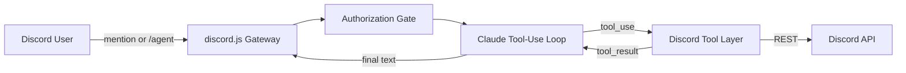

# Discord bot controlled by a Claude agent

A discord.js bot that hands requests from your server's admins to a Claude tool-use loop. The agent can reach
the whole Discord REST API (about 240 operations) through tools.



## Requirements

- Node.js 18.17 or newer (Node 20+ recommended)
- An Anthropic API key
- A Discord application with a bot user

## Setup

### 1. Anthropic API key

1. Create a key at <https://console.anthropic.com>.
2. Put it in `.env` as `ANTHROPIC_API_KEY`.
3. Set `ANTHROPIC_MODEL` to a model your key can use (default: `claude-sonnet-4-5`).

### 2. Discord application and bot token

1. Open <https://discord.com/developers/applications> and create an application. Copy the **Application ID**
   (`DISCORD_APP_ID`).
2. Open the **Bot** tab, click **Reset Token**, and copy it into `.env` as `DISCORD_BOT_TOKEN`.
3. On the same tab, under **Privileged Gateway Intents**, enable **Message Content Intent** and
   **Server Members Intent**.
4. Open **OAuth2 > URL Generator**, select the scopes `bot` and `applications.commands`, and choose permissions.
   Administrator lets every endpoint work; pick granular permissions if you want to limit the agent.
   Or use this URL, replacing `APP_ID`:
   `https://discord.com/oauth2/authorize?client_id=APP_ID&scope=bot%20applications.commands&permissions=8`
5. Open the URL and add the bot to your server.
6. In Discord, enable **Developer Mode** (User Settings > Advanced). Right-click your server and copy its ID
   (`DISCORD_GUILD_ID`). Right-click yourself and copy your user ID (`OWNER_USER_ID`).

### 3. Configure and run

```bash
npm install
cp .env.example .env        # on Windows PowerShell: Copy-Item .env.example .env
# fill in .env
npm run dev                 # watch mode
# or
npm start
```

On startup the bot logs in, checks that it is a member of `DISCORD_GUILD_ID`, and registers the `/agent` and
`/agent-reset` slash commands for that server.

`.env` is gitignored. Never commit your tokens. If a token leaks, reset it in the Developer Portal or Anthropic console.

## Using it

- Mention the bot: `@Bot create a private channel called staff-notes under the Admin category`
- Or use the slash command: `/agent request: list every role that has no members`
- `@Bot reset` or `/agent-reset` clears the agent's memory for that channel.

The bot keeps a short rolling memory per channel (`HISTORY_WINDOW` messages) so follow-ups like "now rename it"
work. Tool results are not remembered between requests.

## How the tools work

| Layer | Tools | Purpose |
| --- | --- | --- |
| Curated | `send_message`, `read_messages`, `list_channels`, `create_channel`, `list_roles`, `find_members`, `manage_roles`, `kick_member`, `timeout_member` | Clean schemas for routine actions |
| Meta | `discord_search_endpoints`, `discord_call` | Reach any other REST operation by searching for it and calling it by `operation_id` |

The meta-tools are backed by a registry generated from Discord's official OpenAPI spec
(`src/tools/generated/endpoints.json`). Registering 240 separate tools would swamp the model's context, so the
agent searches for the operation it needs, reads its exact schema, then calls it. To refresh the registry after
Discord changes its API:

```bash
npm run gen:endpoints
```

Every call goes through `callOperation` in `src/tools/discordCall.ts`, which:

- validates path/query params and the JSON body against the spec's schema,
- pins `guild_id` and `application_id` to your configured server and app,
- rejects channel IDs that belong to another server,
- blocks `leave_guild`, `create_dm`, and group DM membership changes,
- asks for confirmation on risky calls (see below),
- passes through `@discordjs/rest`, which handles rate limits.

Not supported: operations that only accept multipart file uploads.

## Safety

An LLM holding moderator permissions needs guardrails:

- **Access control** (all set in `.env`; a request must pass every check):
  - *Which server:* only `DISCORD_GUILD_ID`. Requests from any other server are ignored, and API calls are pinned to it.
  - *Which channels:* `ALLOWED_CHANNEL_IDS` (comma-separated). Empty means any channel in the server. Threads inherit
    from their parent channel. In a channel that is not on the list the bot stays silent.
  - *Who:* `OWNER_USER_ID` (always allowed), plus anyone in `ALLOWED_USER_IDS` or holding a role in `ALLOWED_ROLE_IDS`.
    Everyone else gets a "not authorized" reply.
- **Confirmation buttons:** deletes, bans, kicks, bulk deletes, and role, permission, member, and server-setting
  changes post a Confirm/Cancel message. Only the requester can answer, and it times out after 60 seconds.
  Classification lives in `classifyRisk` in `src/safety/confirm.ts`.
- **Untrusted content:** the system prompt tells the model that anything it reads in Discord is data, not instructions.
- **No mass pings:** `send_message` disables `@everyone` and `@here`, and agent replies never ping.
- **Audit log:** every tool call is appended to `logs/audit.jsonl` (who asked, tool, input, outcome). Discord's own
  audit log also records the actions with a "Claude agent (requested by ...)" reason.
- **Limits:** `MAX_AGENT_ITERATIONS`, `MAX_OUTPUT_TOKENS`, and `MAX_TURN_TOKENS` cap a single request.

Start with granular bot permissions and widen them as you gain trust.

## Project layout

```
src/index.ts              client bootstrap, triggers, responders
src/config.ts             env validation
src/auth.ts               authorization gate
src/discord.ts            Discord client and REST factory
src/agent/loop.ts         Claude tool-use loop and per-channel history
src/agent/prompt.ts       system prompt
src/tools/registry.ts     tool list, Anthropic tool format, dispatch
src/tools/curated.ts      first-class tools
src/tools/discordCall.ts  meta-tools and the guarded REST executor
src/safety/confirm.ts     risk classification, confirmation buttons, audit log
scripts/gen-endpoints.ts  OpenAPI spec to endpoint registry
```

## Troubleshooting

- **"Used disallowed intents":** enable the Message Content and Server Members intents on the Bot tab.
- **Slash commands missing:** the bot must be in the server and invited with the `applications.commands` scope.
- **"Missing Permissions" errors from tools:** the bot's role is below the target role/member, or lacks the permission.
  Move the bot's role higher in Server Settings > Roles.
- **Model not found:** set `ANTHROPIC_MODEL` to a model your key has access to.
