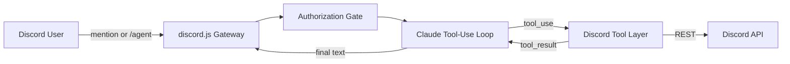

# Discord bot controlled by a Claude agent

A discord.js bot that hands requests from anyone in your server to a Claude tool-use loop. Music, games, and
the other features are open to every member. Changing Discord (moderation, channels, roles, and similar) stays
limited to the owner and allowed admins. The agent can reach the whole Discord REST API (about 240 operations)
through tools, and non-admin writes are rejected in code.



## Requirements

- Node.js **22.12+** for Discord voice / DAVE (music). `npm start` auto-selects Node 22 if your
  shell still has an older Node (e.g. Hermes at `%LOCALAPPDATA%\hermes\node`). Override with `NODE_BINARY`.
- An Anthropic API key
- A Discord application with a bot user

## Setup

### 1. Anthropic API key

1. Create a key at <https://console.anthropic.com>.
2. Put it in `.env` as `ANTHROPIC_API_KEY`.
3. Set `ANTHROPIC_MODEL` to a model your key can use (default: `claude-sonnet-5`). Run `npm run models` to list
   the IDs available to your key.

### 2. Discord application and bot token

1. Open <https://discord.com/developers/applications> and create an application. Copy the **Application ID**
   (`DISCORD_APP_ID`).
2. Open the **Bot** tab, click **Reset Token**, and copy it into `.env` as `DISCORD_BOT_TOKEN`.
3. On the same tab, under **Privileged Gateway Intents**, enable **Message Content Intent** and
   **Server Members Intent**.
4. Open **OAuth2 > URL Generator**, select the scopes `bot` and `applications.commands`, and choose permissions.
   Administrator lets every endpoint work; pick granular permissions if you want to limit the agent.
   Or use this URL, replacing `APP_ID`:
   `https://discord.com/oauth2/authorize?client_id=APP_ID&scope=bot%20applications.commands&permissions=8`
5. Open the URL and add the bot to your server.
6. In Discord, enable **Developer Mode** (User Settings > Advanced). Right-click your server and copy its ID
   (`DISCORD_GUILD_ID`). Right-click yourself and copy your user ID (`OWNER_USER_ID`).

### 3. Configure and run

```bash
npm install
cp .env.example .env        # on Windows PowerShell: Copy-Item .env.example .env
# fill in .env
npm run dev                 # watch mode
# or
npm start
```

On startup the bot logs in, checks that it is a member of `DISCORD_GUILD_ID`, and registers the `/agent` and
`/agent-reset` slash commands for that server.

`.env` is gitignored. Never commit your tokens. If a token leaks, reset it in the Developer Portal or Anthropic console.

## Using it

- Mention the bot: `@Bot create a private channel called staff-notes under the Admin category`
- Or use the slash command: `/agent request: list every role that has no members`
- `@Bot reset` or `/agent-reset` clears the agent's memory for that channel.

The bot keeps a short rolling memory per channel (`HISTORY_WINDOW` messages) so follow-ups like "now rename it"
work. Tool results are not remembered between requests.

## Features

Everything is an agent tool: mention the bot or use `/agent`. For example `@Bot purge the last 20 messages`,
`@Bot how many coins do I have?`, or `@Bot blackjack for 50`.

| Feature | Agent tools | Notes |
| --- | --- | --- |
| Economy | `economy_balance`, `economy_leaderboard` (read-only) | Accounts are keyed by Discord user ID and created automatically when a member joins (and for everyone already in the server on startup). Members earn coins in voice chat (`VOICE_PAY_*`). The agent can never mint or gift coins. |
| Games | `play_blackjack`, `play_coinflip` | `@Bot blackjack, 50 coins` / `half` / `all`; `@Bot flip 20 on tails`. Bets are escrowed from the requester's own balance, settled once, and refunded if the bot crashes mid-hand. The agent can't influence cards, flips, or payouts. |
| Moderation | `purge_messages`, `start_vote_timeout` | Purge needs Manage Messages and asks for confirmation. Vote timeout needs `VOTE_TIMEOUT_MIN_VOTES` yes votes. For an immediate timeout use `timeout_member`. |
| Images | `generate_image` | Needs `OPENAI_API_KEY` (the tool tells you if it's missing). 30s cooldown per user. |
| Music | `music_join`, `music_play`, `music_add`, `music_skip`, `music_stop`, `music_clear`, `music_queue`, `music_move`, `music_remove`, `music_pause`, `music_resume`, `music_leave` | Agent-controlled voice queue. Requires `yt-dlp` and `ffmpeg` on PATH (or `YTDLP_PATH` / `FFMPEG_PATH`). Requester must be in a voice channel. Load skill `music` for intent mapping. |
| CS Tracker | `cs_link_steam`, `cs_unlink_steam`, `cs_list_links`, `cs_set_primary`, `cs_player`, `cs_compare`, `cs_search`, `cs_refresh`, `cs_match`, `cs_import_match`, `cs_leaderboard` | Discord user → many Steam accounts (`data/cs-links.json`). `cs_player` merges CSRep + CSST + CSTracker (optional Faceit/Steam Web API). `cs_match` / `cs_import_match` use the CSRep match API (share code or FACEIT id; no demo uploads). Set `CSREP_API_KEY` / `FACEIT_API_KEY` / `STEAM_WEB_API_KEY` as available. Agent formats replies from the tool result — does not invent stats. |

Minecraft control was removed from the old GearmyBot port. Old GearmyBot mapping: `?saveEconState` is gone (saving is automatic);
`?econStatus` / `?leaderboard` → ask the agent for the leaderboard; `?chat` → mention the bot;
`?join` / `?play` / `?queue` → ask the agent (music_* tools).

**Importing the old balances** (the old bot stored them by username in `gamblingModules/econ.json`). Stop the bot, then:

```bash
npm run import:legacy -- "C:\path\to\DiscordBot-GearmyBot-\gamblingModules\econ.json"
```

Each person's old balance is claimed automatically when their account is created (on join or startup seed), matched on their current username.

Tests: `npm test` (blackjack rules, bet parsing, and the economy store).

## How the tools work

| Layer | Tools | Purpose |
| --- | --- | --- |
| Skills | `load_skill` | On-demand playbooks (e.g. `discord-api`) mapping intents like "mute" to the right tool/endpoint |
| Curated | `send_message`, `read_messages`, `list_channels`, `create_channel`, `list_roles`, `find_members`, `manage_roles`, `kick_member`, `timeout_member` | Clean schemas for routine actions |
| Feature | `purge_messages`, `generate_image`, `play_blackjack`, `play_coinflip`, `start_vote_timeout`, `economy_*` | See [Features](#features) |
| Meta | `discord_search_endpoints`, `discord_call` | Reach any other REST operation by searching for it and calling it by `operation_id` |

Skills live in `src/agent/skills/<name>/SKILL.md`. The agent loads them on demand, e.g.
`load_skill name="music" topic="play"`, `load_skill name="features" topic="blackjack"`, or
`load_skill name="discord-api" topic="mute"`.

### Music host deps

```bash
# examples — use whatever installs yt-dlp + ffmpeg on your OS
winget install yt-dlp.yt-dlp
winget install Gyan.FFmpeg
```

The bot needs **Connect** and **Speak** in the voice channel. YouTube extraction can break when sites change; update yt-dlp when play fails.

The meta-tools are backed by a registry generated from Discord's official OpenAPI spec
(`src/tools/generated/endpoints.json`). Registering 240 separate tools would swamp the model's context, so the
agent searches for the operation it needs, reads its exact schema, then calls it. To refresh the registry after
Discord changes its API:

```bash
npm run gen:endpoints
```

Every call goes through `callOperation` in `src/tools/discordCall.ts`, which:

- validates path/query params and the JSON body against the spec's schema,
- pins `guild_id` and `application_id` to your configured server and app,
- rejects channel IDs that belong to another server,
- blocks `leave_guild`, `create_dm`, and group DM membership changes,
- asks for confirmation on risky calls (see below),
- passes through `@discordjs/rest`, which handles rate limits.

Not supported: operations that only accept multipart file uploads.

## Safety

An LLM holding moderator permissions needs guardrails:

- **Access control** (all set in `.env`; a request must pass every check):
  - *Which server:* only `DISCORD_GUILD_ID`. Requests from any other server are ignored, and API calls are pinned to it.
  - *Which channels:* `ALLOWED_CHANNEL_IDS` (comma-separated). Empty means any channel in the server. Threads inherit
    from their parent channel. In a channel that is not on the list the bot stays silent.
  - *Who can use it:* every member of that server. Mentions and `/agent` work for anyone in an allowed channel.
  - *Who can change Discord:* `OWNER_USER_ID`, plus anyone in `ALLOWED_USER_IDS` or holding a role in
    `ALLOWED_ROLE_IDS`. Everyone else can use music, games, economy, images, and CS lookups, and can ask the bot
    to read messages or look up channels, roles, and members. They cannot moderate or change the server
    (channels, roles, permissions, kicks, bans, timeouts, purges, vote timeouts, or sending and deleting messages).
    That block is enforced in code, not only in the prompt.
- **Confirmation buttons:** deletes, bans, kicks, bulk deletes, and role, permission, member, and server-setting
  changes post a Confirm/Cancel message. Only the requester can answer, and it times out after 60 seconds.
  Classification lives in `classifyRisk` in `src/safety/confirm.ts`.
- **Untrusted content:** the system prompt tells the model that anything it reads in Discord is data, not instructions.
- **No mass pings:** `send_message` disables `@everyone` and `@here`, and agent replies never ping.
- **Audit log:** every tool call is appended to `logs/audit.jsonl` (who asked, tool, input, outcome). Discord's own
  audit log also records the actions with a "Claude agent (requested by ...)" reason.
- **Limits:** `MAX_AGENT_ITERATIONS`, `MAX_OUTPUT_TOKENS`, and `MAX_TURN_TOKENS` cap a single request.

Start with granular bot permissions and widen them as you gain trust.

## Project layout

```
src/index.ts              client bootstrap, triggers, responders
src/config.ts             env validation
src/auth.ts               authorization gate
src/discord.ts            Discord client and REST factory
src/agent/loop.ts         Claude tool-use loop and per-channel history
src/agent/prompt.ts       system prompt
src/agent/skills/         on-demand agent playbooks (discord-api, …)
src/tools/registry.ts     tool list, Anthropic tool format, dispatch
src/tools/curated.ts      first-class tools
src/tools/discordCall.ts  meta-tools and the guarded REST executor
src/safety/confirm.ts     risk classification, confirmation buttons, audit log
src/features/             feature agent tools (economy, games, moderation, images)
src/tools/channels.ts     channel resolution shared by tools
scripts/gen-endpoints.ts  OpenAPI spec to endpoint registry
```

## Troubleshooting

- **"Used disallowed intents":** enable the Message Content and Server Members intents on the Bot tab.
- **Slash commands missing:** the bot must be in the server and invited with the `applications.commands` scope.
- **"Missing Permissions" errors from tools:** the bot's role is below the target role/member, or lacks the permission.
  Move the bot's role higher in Server Settings > Roles.
- **Model not found:** set `ANTHROPIC_MODEL` to a model your key has access to.
